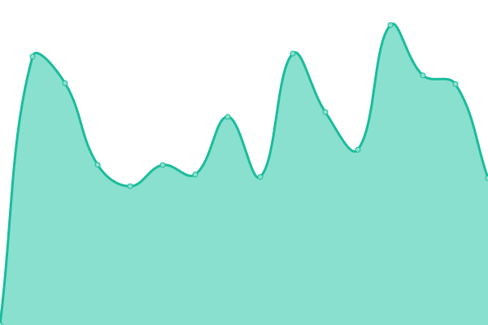

# [📈 Live Status](https://definiteIymaybe.github.io/upptime): <!--live status--> **🟩 All systems operational**

<!--start: status pages-->
<!-- This summary is generated by Upptime (https://github.com/upptime/upptime) -->
<!-- Do not edit this manually, your changes will be overwritten -->
<!-- prettier-ignore -->
| URL | Status | History | Response Time | Uptime |
| --- | ------ | ------- | ------------- | ------ |
|  [memo.ru](https://memo.ru) | 🟩 Up | [memo-ru.yml](https://github.com/definiteIymaybe/uptime/commits/HEAD/history/memo-ru.yml) | 

 2761ms
     
 | 

<a href="https://definiteIymaybe.github.io/uptime/history/memo-ru">97.62%</a>
    

|  [1968.memo.ru](https://1968.memo.ru) | 🟩 Up | [1968-memo-ru.yml](https://github.com/definiteIymaybe/uptime/commits/HEAD/history/1968-memo-ru.yml) | 

 385ms
     
 | 

<a href="https://definiteIymaybe.github.io/uptime/history/1968-memo-ru">100.00%</a>
    

|  [1989.memo.ru](http://1989.memo.ru) | 🟩 Up | [1989-memo-ru.yml](https://github.com/definiteIymaybe/uptime/commits/HEAD/history/1989-memo-ru.yml) | 

 297ms
     
 | 

<a href="https://definiteIymaybe.github.io/uptime/history/1989-memo-ru">100.00%</a>
    

|  [30marta.memo.ru](https://30marta.memo.ru) | 🟩 Up | [30marta-memo-ru.yml](https://github.com/definiteIymaybe/uptime/commits/HEAD/history/30marta-memo-ru.yml) | 

 687ms
     
 | 

<a href="https://definiteIymaybe.github.io/uptime/history/30marta-memo-ru">55.92%</a>
    

|  [afternoon.1968.memo.ru](https://afternoon.1968.memo.ru) | 🟩 Up | [afternoon-1968-memo-ru.yml](https://github.com/definiteIymaybe/uptime/commits/HEAD/history/afternoon-1968-memo-ru.yml) | 

 725ms
     
 | 

<a href="https://definiteIymaybe.github.io/uptime/history/afternoon-1968-memo-ru">100.00%</a>
    

|  [alexanderyakovlev.org](https://alexanderyakovlev.org) | 🟩 Up | [alexanderyakovlev-org.yml](https://github.com/definiteIymaybe/uptime/commits/HEAD/history/alexanderyakovlev-org.yml) | 

 924ms
     
 | 

<a href="https://definiteIymaybe.github.io/uptime/history/alexanderyakovlev-org">100.00%</a>
    

|  [archive.tastorona.su](http://archive.tastorona.su) | 🟩 Up | [archive-tastorona-su.yml](https://github.com/definiteIymaybe/uptime/commits/HEAD/history/archive-tastorona-su.yml) | 

 987ms
     
 | 

<a href="https://definiteIymaybe.github.io/uptime/history/archive-tastorona-su">100.00%</a>
    

|  [backhome.memo.ru](https://backhome.memo.ru) | 🟩 Up | [backhome-memo-ru.yml](https://github.com/definiteIymaybe/uptime/commits/HEAD/history/backhome-memo-ru.yml) | 

 1121ms
     
 | 

<a href="https://definiteIymaybe.github.io/uptime/history/backhome-memo-ru">100.00%</a>
    

|  [base.memo.ru](https://base.memo.ru) | 🟩 Up | [base-memo-ru.yml](https://github.com/definiteIymaybe/uptime/commits/HEAD/history/base-memo-ru.yml) | 

 790ms
     
 | 

<a href="https://definiteIymaybe.github.io/uptime/history/base-memo-ru">100.00%</a>
    

|  [bulletin.memo.ru](http://bulletin.memo.ru) | 🟩 Up | [bulletin-memo-ru.yml](https://github.com/definiteIymaybe/uptime/commits/HEAD/history/bulletin-memo-ru.yml) | 

 216ms
     
 | 

<a href="https://definiteIymaybe.github.io/uptime/history/bulletin-memo-ru">100.00%</a>
    

|  [cathol.memo.ru](http://cathol.memo.ru) | 🟩 Up | [cathol-memo-ru.yml](https://github.com/definiteIymaybe/uptime/commits/HEAD/history/cathol-memo-ru.yml) | 

 219ms
     
 | 

<a href="https://definiteIymaybe.github.io/uptime/history/cathol-memo-ru">100.00%</a>
    

|  [donate.memo.ru](https://donate.memo.ru) | 🟩 Up | [donate-memo-ru.yml](https://github.com/definiteIymaybe/uptime/commits/HEAD/history/donate-memo-ru.yml) | 

 640ms
     
 | 

<a href="https://definiteIymaybe.github.io/uptime/history/donate-memo-ru">56.15%</a>
    

|  [dostup.memo.ru](https://dostup.memo.ru) | 🟩 Up | [dostup-memo-ru.yml](https://github.com/definiteIymaybe/uptime/commits/HEAD/history/dostup-memo-ru.yml) | 

 883ms
     
 | 

<a href="https://definiteIymaybe.github.io/uptime/history/dostup-memo-ru">100.00%</a>
    

|  [fond21.memo.ru](https://fond21.memo.ru) | 🟩 Up | [fond21-memo-ru.yml](https://github.com/definiteIymaybe/uptime/commits/HEAD/history/fond21-memo-ru.yml) | 

 1596ms
     
 | 

<a href="https://definiteIymaybe.github.io/uptime/history/fond21-memo-ru">99.56%</a>
    

|  [histor-ipt-kt.memo.ru](http://histor-ipt-kt.memo.ru) | 🟩 Up | [histor-ipt-kt-memo-ru.yml](https://github.com/definiteIymaybe/uptime/commits/HEAD/history/histor-ipt-kt-memo-ru.yml) | 

 174ms
     
 | 

<a href="https://definiteIymaybe.github.io/uptime/history/histor-ipt-kt-memo-ru">100.00%</a>
    

|  [topos.memo.ru](https://topos.memo.ru) | 🟩 Up | [topos-memo-ru.yml](https://github.com/definiteIymaybe/uptime/commits/HEAD/history/topos-memo-ru.yml) | 

 977ms
     
 | 

<a href="https://definiteIymaybe.github.io/uptime/history/topos-memo-ru">100.00%</a>
    

|  [hts.memo.ru](http://hts.memo.ru) | 🟩 Up | [hts-memo-ru.yml](https://github.com/definiteIymaybe/uptime/commits/HEAD/history/hts-memo-ru.yml) | 

 291ms
     
 | 

<a href="https://definiteIymaybe.github.io/uptime/history/hts-memo-ru">99.57%</a>
    

|  [konkurs.memo.ru](http://konkurs.memo.ru) | 🟩 Up | [konkurs-memo-ru.yml](https://github.com/definiteIymaybe/uptime/commits/HEAD/history/konkurs-memo-ru.yml) | 

 1735ms
     
 | 

<a href="https://definiteIymaybe.github.io/uptime/history/konkurs-memo-ru">100.00%</a>
    

|  [lib.memo.ru](https://lib.memo.ru) | 🟩 Up | [lib-memo-ru.yml](https://github.com/definiteIymaybe/uptime/commits/HEAD/history/lib-memo-ru.yml) | 

 765ms
     
 | 

<a href="https://definiteIymaybe.github.io/uptime/history/lib-memo-ru">99.58%</a>
    

|  [lists.memo.ru](http://lists.memo.ru) | 🟩 Up | [lists-memo-ru.yml](https://github.com/definiteIymaybe/uptime/commits/HEAD/history/lists-memo-ru.yml) | 

 165ms
     
 | 

<a href="https://definiteIymaybe.github.io/uptime/history/lists-memo-ru">100.00%</a>
    

|  [listsbook.memo.ru](http://listsbook.memo.ru) | 🟩 Up | [listsbook-memo-ru.yml](https://github.com/definiteIymaybe/uptime/commits/HEAD/history/listsbook-memo-ru.yml) | 

 181ms
     
 | 

<a href="https://definiteIymaybe.github.io/uptime/history/listsbook-memo-ru">100.00%</a>
    

|  [memo.ru](https://memo.ru) | 🟩 Up | [memo-ru.yml](https://github.com/definiteIymaybe/uptime/commits/HEAD/history/memo-ru.yml) | 

 2761ms
     
 | 

<a href="https://definiteIymaybe.github.io/uptime/history/memo-ru">97.62%</a>
    

|  [memoirs.memo.ru](https://memoirs.memo.ru) | 🟩 Up | [memoirs-memo-ru.yml](https://github.com/definiteIymaybe/uptime/commits/HEAD/history/memoirs-memo-ru.yml) | 

 2589ms
     
 | 

<a href="https://definiteIymaybe.github.io/uptime/history/memoirs-memo-ru">100.00%</a>
    

|  [mos.memo.ru](https://mos.memo.ru) | 🟩 Up | [mos-memo-ru.yml](https://github.com/definiteIymaybe/uptime/commits/HEAD/history/mos-memo-ru.yml) | 

 111ms
     
 | 

<a href="https://definiteIymaybe.github.io/uptime/history/mos-memo-ru">100.00%</a>
    

|  [museum.memo.ru](https://museum.memo.ru) | 🟩 Up | [museum-memo-ru.yml](https://github.com/definiteIymaybe/uptime/commits/HEAD/history/museum-memo-ru.yml) | 

 770ms
     
 | 

<a href="https://definiteIymaybe.github.io/uptime/history/museum-memo-ru">99.58%</a>
    

|  [nkvd.memo.ru](https://nkvd.memo.ru) | 🟩 Up | [nkvd-memo-ru.yml](https://github.com/definiteIymaybe/uptime/commits/HEAD/history/nkvd-memo-ru.yml) | 

 1384ms
     
 | 

<a href="https://definiteIymaybe.github.io/uptime/history/nkvd-memo-ru">97.43%</a>
    

|  [notepad.memo.ru](http://notepad.memo.ru) | 🟩 Up | [notepad-memo-ru.yml](https://github.com/definiteIymaybe/uptime/commits/HEAD/history/notepad-memo-ru.yml) | 

 1445ms
     
 | 

<a href="https://definiteIymaybe.github.io/uptime/history/notepad-memo-ru">99.59%</a>
    

|  [october29.ru](https://october29.ru) | 🟩 Up | [october29-ru.yml](https://github.com/definiteIymaybe/uptime/commits/HEAD/history/october29-ru.yml) | 

 750ms
     
 | 

<a href="https://definiteIymaybe.github.io/uptime/history/october29-ru">100.00%</a>
    

|  [oskolki.memo.ru](https://oskolki.memo.ru) | 🟩 Up | [oskolki-memo-ru.yml](https://github.com/definiteIymaybe/uptime/commits/HEAD/history/oskolki-memo-ru.yml) | 

 123ms
     
 | 

<a href="https://definiteIymaybe.github.io/uptime/history/oskolki-memo-ru">100.00%</a>
    

|  [ost-west.memo.ru](https://ost-west.memo.ru) | 🟩 Up | [ost-west-memo-ru.yml](https://github.com/definiteIymaybe/uptime/commits/HEAD/history/ost-west-memo-ru.yml) | 

 601ms
     
 | 

<a href="https://definiteIymaybe.github.io/uptime/history/ost-west-memo-ru">100.00%</a>
    

|  [svobodanogami.ru](https://svobodanogami.ru) | 🟩 Up | [svobodanogami-ru.yml](https://github.com/definiteIymaybe/uptime/commits/HEAD/history/svobodanogami-ru.yml) | 

 291ms
     
 | 

<a href="https://definiteIymaybe.github.io/uptime/history/svobodanogami-ru">100.00%</a>
    

<!--end: status pages-->

[**Visit our status website →**](https://definiteIymaybe.github.io/uptime)

## 📄 License

- Powered by: [Upptime](https://github.com/upptime/upptime)
- Code: [MIT](./LICENSE) © [mikhail sergienko](https://definiteIymaybe.github.io/uptime)
- Data in the `./history` directory: [Open Database License](https://opendatacommons.org/licenses/odbl/1-0/)
