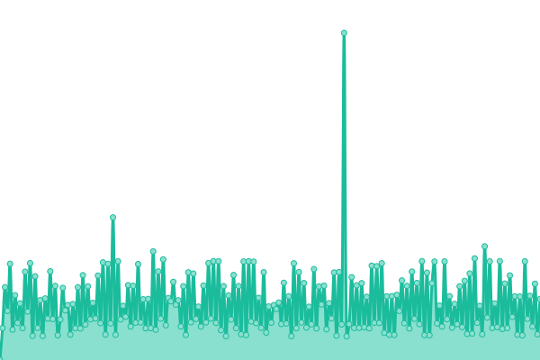

# [📈 Live Status](https://definiteIymaybe.github.io/upptime): <!--live status--> **🟧 Partial outage**

<!--start: status pages-->
<!-- This summary is generated by Upptime (https://github.com/upptime/upptime) -->
<!-- Do not edit this manually, your changes will be overwritten -->
<!-- prettier-ignore -->
| URL | Status | History | Response Time | Uptime |
| --- | ------ | ------- | ------------- | ------ |
|  [memo.ru](https://memo.ru) | 🟩 Up | [memo-ru.yml](https://github.com/definiteIymaybe/uptime/commits/HEAD/history/memo-ru.yml) | 

 2385ms
     
 | 

<a href="https://definiteIymaybe.github.io/uptime/history/memo-ru">99.28%</a>
    

|  [1968.memo.ru](https://1968.memo.ru) | 🟩 Up | [1968-memo-ru.yml](https://github.com/definiteIymaybe/uptime/commits/HEAD/history/1968-memo-ru.yml) | 

 373ms
     
 | 

<a href="https://definiteIymaybe.github.io/uptime/history/1968-memo-ru">99.28%</a>
    

|  [1989.memo.ru](http://1989.memo.ru) | 🟩 Up | [1989-memo-ru.yml](https://github.com/definiteIymaybe/uptime/commits/HEAD/history/1989-memo-ru.yml) | 

 281ms
     
 | 

<a href="https://definiteIymaybe.github.io/uptime/history/1989-memo-ru">99.28%</a>
    

|  [30marta.memo.ru](https://30marta.memo.ru) | 🟥 Down | [30marta-memo-ru.yml](https://github.com/definiteIymaybe/uptime/commits/HEAD/history/30marta-memo-ru.yml) | 

 1124ms
     
 | 

<a href="https://definiteIymaybe.github.io/uptime/history/30marta-memo-ru">74.18%</a>
    

|  [afternoon.1968.memo.ru](https://afternoon.1968.memo.ru) | 🟩 Up | [afternoon-1968-memo-ru.yml](https://github.com/definiteIymaybe/uptime/commits/HEAD/history/afternoon-1968-memo-ru.yml) | 

 2144ms
     
 | 

<a href="https://definiteIymaybe.github.io/uptime/history/afternoon-1968-memo-ru">93.73%</a>
    

|  [alexanderyakovlev.org](https://alexanderyakovlev.org) | 🟩 Up | [alexanderyakovlev-org.yml](https://github.com/definiteIymaybe/uptime/commits/HEAD/history/alexanderyakovlev-org.yml) | 

 639ms
     
 | 

<a href="https://definiteIymaybe.github.io/uptime/history/alexanderyakovlev-org">99.16%</a>
    

|  [archive.tastorona.su](http://archive.tastorona.su) | 🟩 Up | [archive-tastorona-su.yml](https://github.com/definiteIymaybe/uptime/commits/HEAD/history/archive-tastorona-su.yml) | 

 879ms
     
 | 

<a href="https://definiteIymaybe.github.io/uptime/history/archive-tastorona-su">100.00%</a>
    

|  [backhome.memo.ru](https://backhome.memo.ru) | 🟩 Up | [backhome-memo-ru.yml](https://github.com/definiteIymaybe/uptime/commits/HEAD/history/backhome-memo-ru.yml) | 

 866ms
     
 | 

<a href="https://definiteIymaybe.github.io/uptime/history/backhome-memo-ru">99.28%</a>
    

|  [base.memo.ru](https://base.memo.ru) | 🟩 Up | [base-memo-ru.yml](https://github.com/definiteIymaybe/uptime/commits/HEAD/history/base-memo-ru.yml) | 

 564ms
     
 | 

<a href="https://definiteIymaybe.github.io/uptime/history/base-memo-ru">99.28%</a>
    

|  [bulletin.memo.ru](http://bulletin.memo.ru) | 🟩 Up | [bulletin-memo-ru.yml](https://github.com/definiteIymaybe/uptime/commits/HEAD/history/bulletin-memo-ru.yml) | 

 219ms
     
 | 

<a href="https://definiteIymaybe.github.io/uptime/history/bulletin-memo-ru">99.29%</a>
    

|  [cathol.memo.ru](http://cathol.memo.ru) | 🟩 Up | [cathol-memo-ru.yml](https://github.com/definiteIymaybe/uptime/commits/HEAD/history/cathol-memo-ru.yml) | 

 222ms
     
 | 

<a href="https://definiteIymaybe.github.io/uptime/history/cathol-memo-ru">99.29%</a>
    

|  [donate.memo.ru](https://donate.memo.ru) | 🟥 Down | [donate-memo-ru.yml](https://github.com/definiteIymaybe/uptime/commits/HEAD/history/donate-memo-ru.yml) | 

 742ms
     
 | 

<a href="https://definiteIymaybe.github.io/uptime/history/donate-memo-ru">74.15%</a>
    

|  [dostup.memo.ru](https://dostup.memo.ru) | 🟩 Up | [dostup-memo-ru.yml](https://github.com/definiteIymaybe/uptime/commits/HEAD/history/dostup-memo-ru.yml) | 

 719ms
     
 | 

<a href="https://definiteIymaybe.github.io/uptime/history/dostup-memo-ru">99.29%</a>
    

|  [fond21.memo.ru](https://fond21.memo.ru) | 🟩 Up | [fond21-memo-ru.yml](https://github.com/definiteIymaybe/uptime/commits/HEAD/history/fond21-memo-ru.yml) | 

 1545ms
     
 | 

<a href="https://definiteIymaybe.github.io/uptime/history/fond21-memo-ru">0.00%</a>
    

|  [histor-ipt-kt.memo.ru](http://histor-ipt-kt.memo.ru) | 🟩 Up | [histor-ipt-kt-memo-ru.yml](https://github.com/definiteIymaybe/uptime/commits/HEAD/history/histor-ipt-kt-memo-ru.yml) | 

 297ms
     
 | 

<a href="https://definiteIymaybe.github.io/uptime/history/histor-ipt-kt-memo-ru">99.29%</a>
    

|  [topos.memo.ru](https://topos.memo.ru) | 🟩 Up | [topos-memo-ru.yml](https://github.com/definiteIymaybe/uptime/commits/HEAD/history/topos-memo-ru.yml) | 

 958ms
     
 | 

<a href="https://definiteIymaybe.github.io/uptime/history/topos-memo-ru">100.00%</a>
    

|  [hts.memo.ru](http://hts.memo.ru) | 🟩 Up | [hts-memo-ru.yml](https://github.com/definiteIymaybe/uptime/commits/HEAD/history/hts-memo-ru.yml) | 

 279ms
     
 | 

<a href="https://definiteIymaybe.github.io/uptime/history/hts-memo-ru">0.00%</a>
    

|  [konkurs.memo.ru](http://konkurs.memo.ru) | 🟩 Up | [konkurs-memo-ru.yml](https://github.com/definiteIymaybe/uptime/commits/HEAD/history/konkurs-memo-ru.yml) | 

 1241ms
     
 | 

<a href="https://definiteIymaybe.github.io/uptime/history/konkurs-memo-ru">99.29%</a>
    

|  [lib.memo.ru](https://lib.memo.ru) | 🟩 Up | [lib-memo-ru.yml](https://github.com/definiteIymaybe/uptime/commits/HEAD/history/lib-memo-ru.yml) | 

 678ms
     
 | 

<a href="https://definiteIymaybe.github.io/uptime/history/lib-memo-ru">0.00%</a>
    

|  [lists.memo.ru](http://lists.memo.ru) | 🟩 Up | [lists-memo-ru.yml](https://github.com/definiteIymaybe/uptime/commits/HEAD/history/lists-memo-ru.yml) | 

 292ms
     
 | 

<a href="https://definiteIymaybe.github.io/uptime/history/lists-memo-ru">99.29%</a>
    

|  [listsbook.memo.ru](http://listsbook.memo.ru) | 🟩 Up | [listsbook-memo-ru.yml](https://github.com/definiteIymaybe/uptime/commits/HEAD/history/listsbook-memo-ru.yml) | 

 298ms
     
 | 

<a href="https://definiteIymaybe.github.io/uptime/history/listsbook-memo-ru">99.29%</a>
    

|  [memo.ru](https://memo.ru) | 🟩 Up | [memo-ru.yml](https://github.com/definiteIymaybe/uptime/commits/HEAD/history/memo-ru.yml) | 

 2385ms
     
 | 

<a href="https://definiteIymaybe.github.io/uptime/history/memo-ru">99.28%</a>
    

|  [memoirs.memo.ru](https://memoirs.memo.ru) | 🟩 Up | [memoirs-memo-ru.yml](https://github.com/definiteIymaybe/uptime/commits/HEAD/history/memoirs-memo-ru.yml) | 

 2684ms
     
 | 

<a href="https://definiteIymaybe.github.io/uptime/history/memoirs-memo-ru">100.00%</a>
    

|  [mos.memo.ru](https://mos.memo.ru) | 🟩 Up | [mos-memo-ru.yml](https://github.com/definiteIymaybe/uptime/commits/HEAD/history/mos-memo-ru.yml) | 

 129ms
     
 | 

<a href="https://definiteIymaybe.github.io/uptime/history/mos-memo-ru">99.29%</a>
    

|  [museum.memo.ru](https://museum.memo.ru) | 🟩 Up | [museum-memo-ru.yml](https://github.com/definiteIymaybe/uptime/commits/HEAD/history/museum-memo-ru.yml) | 

 723ms
     
 | 

<a href="https://definiteIymaybe.github.io/uptime/history/museum-memo-ru">100.00%</a>
    

|  [nkvd.memo.ru](https://nkvd.memo.ru) | 🟩 Up | [nkvd-memo-ru.yml](https://github.com/definiteIymaybe/uptime/commits/HEAD/history/nkvd-memo-ru.yml) | 

 1401ms
     
 | 

<a href="https://definiteIymaybe.github.io/uptime/history/nkvd-memo-ru">100.00%</a>
    

|  [notepad.memo.ru](http://notepad.memo.ru) | 🟩 Up | [notepad-memo-ru.yml](https://github.com/definiteIymaybe/uptime/commits/HEAD/history/notepad-memo-ru.yml) | 

 1355ms
     
 | 

<a href="https://definiteIymaybe.github.io/uptime/history/notepad-memo-ru">68.91%</a>
    

|  [october29.ru](https://october29.ru) | 🟥 Down | [october29-ru.yml](https://github.com/definiteIymaybe/uptime/commits/HEAD/history/october29-ru.yml) | 

 558ms
     
 | 

<a href="https://definiteIymaybe.github.io/uptime/history/october29-ru">0.00%</a>
    

|  [oskolki.memo.ru](https://oskolki.memo.ru) | 🟩 Up | [oskolki-memo-ru.yml](https://github.com/definiteIymaybe/uptime/commits/HEAD/history/oskolki-memo-ru.yml) | 

 132ms
     
 | 

<a href="https://definiteIymaybe.github.io/uptime/history/oskolki-memo-ru">99.29%</a>
    

|  [ost-west.memo.ru](https://ost-west.memo.ru) | 🟩 Up | [ost-west-memo-ru.yml](https://github.com/definiteIymaybe/uptime/commits/HEAD/history/ost-west-memo-ru.yml) | 

 556ms
     
 | 

<a href="https://definiteIymaybe.github.io/uptime/history/ost-west-memo-ru">100.00%</a>
    

|  [svobodanogami.ru](https://svobodanogami.ru) | 🟩 Up | [svobodanogami-ru.yml](https://github.com/definiteIymaybe/uptime/commits/HEAD/history/svobodanogami-ru.yml) | 

 258ms
     
 | 

<a href="https://definiteIymaybe.github.io/uptime/history/svobodanogami-ru">99.16%</a>
    

<!--end: status pages-->

[**Visit our status website →**](https://definiteIymaybe.github.io/uptime)

## 📄 License

- Powered by: [Upptime](https://github.com/upptime/upptime)
- Code: [MIT](./LICENSE) © [mikhail sergienko](https://definiteIymaybe.github.io/uptime)
- Data in the `./history` directory: [Open Database License](https://opendatacommons.org/licenses/odbl/1-0/)
